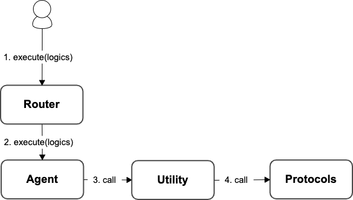

# Maker Utility

In order to handle special operations that cannot be directly performed by the Agent, such as creating a `CDP` on `Maker`, it is necessary to complete these operations before proceeding with subsequent steps on this `CDP`.

&#x20;Therefore we have established a **utility** contract specifically designed to handle such special operations to assist users in using the Composable Router system with more flexibility. Users can interact directly with the **MakerUtility** contract via Agent to complete the `openLockETHAndDraw()` and `openLockGemAndDraw()` operations.

For detailed sample code, please refer to [this link](https://github.com/dinngo/composable-router-contract/blob/release/v0.1.0-ethtaipei/test/integration/AaveV2.t.sol#L119).

<figure><figcaption></figcaption></figure>
